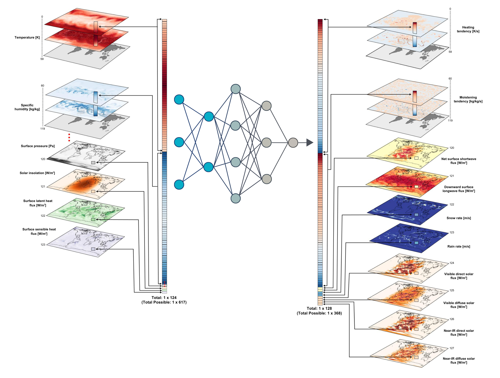

> Forked ClimSim repository for exploring ideas of sparsity, compositional generalisability and invariance, specific details for this version of the repository can be found at the bottom of the readme


[](https://huggingface.co/datasets/LEAP/ClimSim_high-res)
[](https://huggingface.co/datasets/LEAP/ClimSim_low-res)
[](https://huggingface.co/datasets/LEAP/ClimSim_low-res_aqua-planet)

# ClimSim: An open large-scale dataset for training high-resolution physics emulators in hybrid multi-scale climate simulators

ClimSim is the largest-ever dataset designed for hybrid ML-physics research. It comprises multi-scale climate simulations, developed by a consortium of climate scientists and ML researchers. It consists of 5.7 billion pairs of multivariate input and output vectors that isolate the influence of locally-nested, high-resolution, high-fidelity physics on a host climate simulator’s macro-scale physical state.
The dataset is global in coverage, spans multiple years at high sampling frequency, and is designed such that resulting emulators are compatible with downstream coupling into operational climate simulators. 
We implement a range of deterministic and stochastic regression baselines to highlight the ML challenges and their scoring. 




## Getting Started

* [Quickstart](https://leap-stc.github.io/ClimSim/quickstart.html)
* [Dataset Information](https://leap-stc.github.io/ClimSim/dataset.html)
* [Code Installation](https://leap-stc.github.io/ClimSim/installation.html)

## Models and Evaluation

* [Baseline Models](https://leap-stc.github.io/ClimSim/models.html)
* [Evaluation](https://leap-stc.github.io/ClimSim/evaluating.html)

## Demo Notebooks

* [Multi-Layer Perceptron (MLP) Example](https://leap-stc.github.io/ClimSim/demo_notebooks/mlp_example.html)
* [Convolutional Neural Network (CNN) Example](https://leap-stc.github.io/ClimSim/demo_notebooks/cnn_example.html)
* [Water Conservation Example](https://leap-stc.github.io/ClimSim/demo_notebooks/water_conservation.html)

## Online Testing

* [Online Testing](./online_testing/README.md)

## Project Structure

[](https://github.com/leap-stc/ClimSim/tree/main)

* [GitHub Repository Structure](./ARCHITECTURE.md)


## References

* [ClimSim paper](https://arxiv.org/abs/2306.08754)
* [Recorded NeurIPS 2023 talk](https://www.youtube.com/watch?v=Wa1HXB_chYg)
[](https://www.youtube.com/watch?v=Wa1HXB_chYg)

* [Contributor Guide](https://leap-stc.github.io/ClimSim/CONTRIBUTING.html)


## Legal

ClimSim uses the Apache 2.0 license for code found on the associated GitHub repo and the Creative Commons Attribution 4.0 license for data hosted on HuggingFace. The [LICENSE file](https://github.com/leap-stc/ClimSim/blob/main/LICENSE) for the repo can be found in the top-level directory.


## Latex packages for plotting

### On local Mac

1. Install 
```
brew install --cask mactex
```

2. Add to path 

```
nano ~/.bash_profile
```
Add the following line:
```
export PATH="/Library/TeX/texbin:$PATH"
```

3. Apply changes 
```
source ~/.zshrc
```

4. Check 
```
which latex
```
Expected outcome:

```
/Library/TeX/texbin/latex
```

### On cluster (specifically Jasmin)
Use the script `install-texlive.sh` to install necesary packages at your home directory. This doesnt require sudo permissions or access to the root directory!! 

```
bash install-texlive.sh
```
```
export PATH="$HOME/texlive/$(date +%Y)/bin/$(ls $HOME/texlive/$(date +%Y)/bin | head -n1):$PATH"
```

Checks:

```
kpsewhich type1cm.sty
latex -version
dvipng -version
which latex
```

# How to use `uv` to run code

## Installing and preparing `uv`
If `uv` is not already installed, you'll need to run:
```
curl -LsSf https://astral.sh/uv/install.sh | sh
```

add `$HOME/.local/bin` to your PATH
```
source $HOME/.local/bin/env
```

First navigate to the repository
```
cd path/to/folder
```
To create and activate the `.venv`
```
uv venv --seed
source .venv/bin/activate
```
To install the requirements for the project from `pyproject.toml` run. (Any changes to project requirements should be done through the `pyproject.toml`).
```
uv sync
```

## Using `uv`
`uv run` replaces `python filename.py`
Functions using the `@hydra.main` wrapper will get parameters from the appropriate config files; this can be overwritten by passing the parameter as an argument in the terminal.
e.g.
```
uv run filename.py param_a=True
```
or if you want to try different values, use the `-m` flag:
